# CactusCon CTF 2021

## Context

This is my first participation at the CactusCon CTF. 
He has started at 5:00pm on Friday and finished at 01:00am on Saturday.

I finish 68th out of 420 participants.

## 1- 0xevilc0de.com

### Collecting pokemons

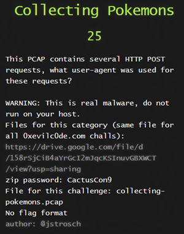

The aim is to find the user-agent used for http post requests. 
We download the .pcap file and open it with wireshark.

Use the filter http.request.method == "POST"

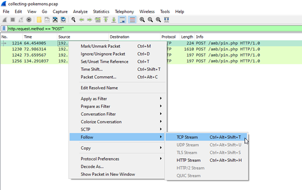

Then Follow TCP stream to find the user-agent.

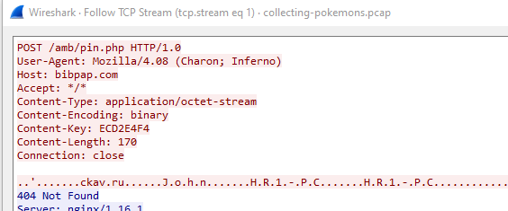

Flag : <b>Mozilla/4.08 (Charon; Inferno)</b>

### DIV Isn't Only for HTML

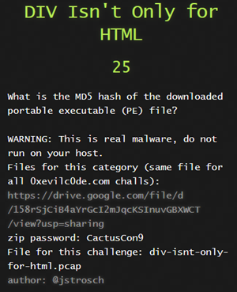

The hash of the executable file must be found. I open the .pcap file 
in the Network Miner tool.

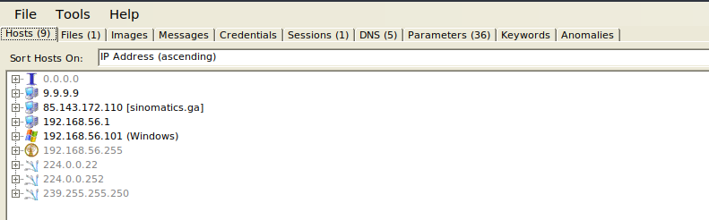

I open the file tab and find the div.exe file. Right click then Calculate MD5 / SHA1 ... hash

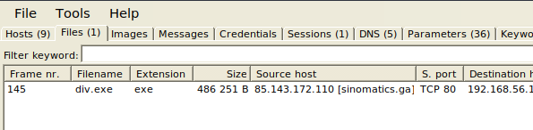

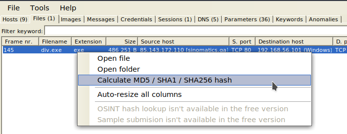

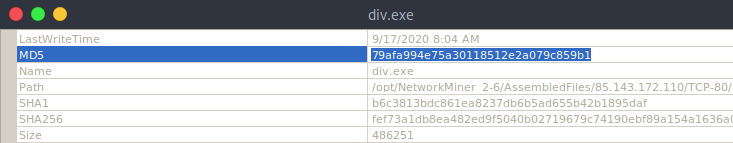

Hash md5 found!

Flag : <b>79afa994e75a30118512e2a079c859b1</b>

### Agent Smith

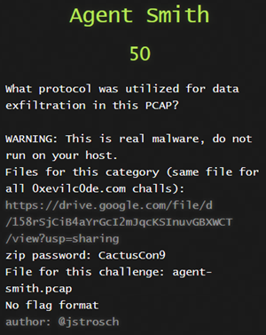

It is necessary to find the protocol used during the data exfiltration. 

I open .pcap file in wireshark and after a little research I find an auth 
then a data exfiltration with the SMTP protocol.

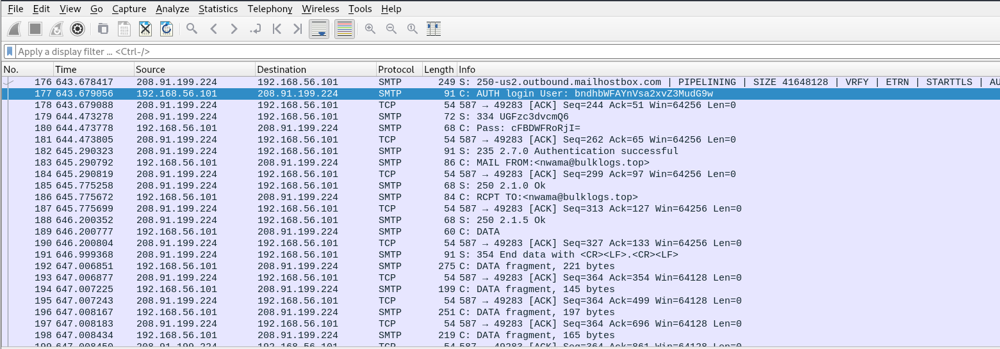

Flag : <b>smtp</b>

## 2- CovidScammers

### Free Flag (and binary)

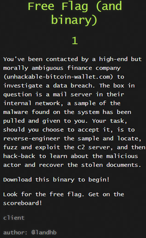

The binary is an executable 32bit LSB ELF. Given the instruction 
i vill simply use the string command and grep to "flag" with the -i</b>
parameter for case sensitive.

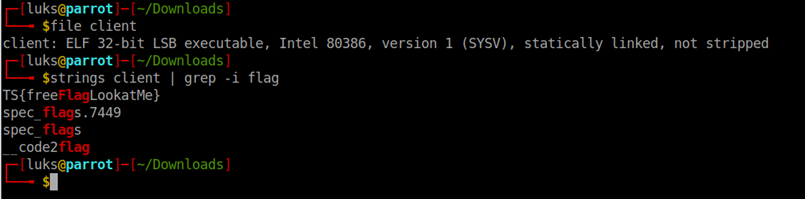

Flag : <b>TS{freeFlagLookatMe}</b>

### Syscalls

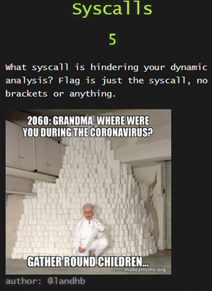

### Who Me?

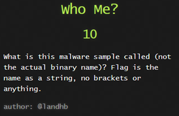

### Scouting

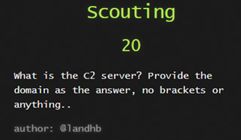

## 3- Cracking

### Easy crack 2

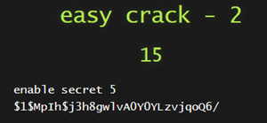

### Easy crack 3

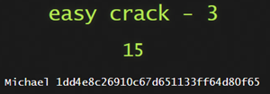

### Easy crack 5

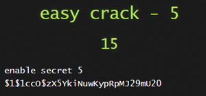

## 4- Feeling Blue

### Dangers of Lateral Movement 1

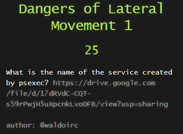

### Dangers of Lateral Movement 2

### Hello Goodbye 2

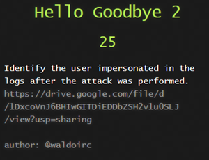

### Hello Goodbye 4

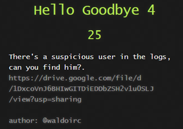

### What SMB Activity? 1

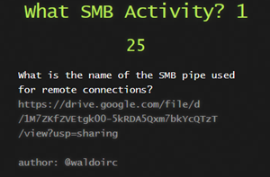

### What SMB Activity? 2

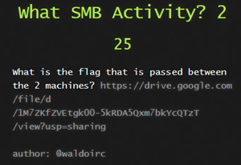

## 5- Misc

### Discord

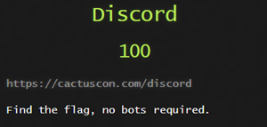

