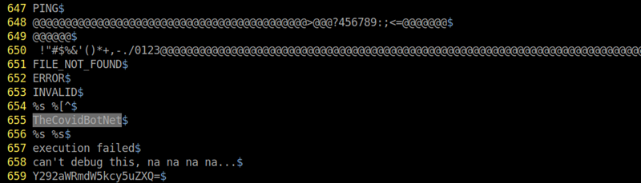

# CactusCon CTF 2021

## Context

This is my first participation at the CactusCon CTF. 
He has started at 5:00pm on Friday and finished at 01:00am on Saturday.

I finish 68th out of 420 participants.

## 1- 0xevilc0de.com

### Collecting pokemons

The aim is to find the user-agent used for http post requests. 
We download the .pcap file and open it with wireshark.

Use the filter http.request.method == "POST"

Then Follow TCP stream to find the user-agent.

Flag : <b>Mozilla/4.08 (Charon; Inferno)</b>

### DIV Isn't Only for HTML

The hash of the executable file must be found. I open the .pcap file 
in the Network Miner tool.

I open the file tab and find the div.exe file. Right click then Calculate MD5 / SHA1 ... hash

Hash md5 found!

Flag : <b>79afa994e75a30118512e2a079c859b1</b>

### Agent Smith

It is necessary to find the protocol used during the data exfiltration. 

I open .pcap file in wireshark and after a little research I find an auth 
then a data exfiltration with the SMTP protocol.

Flag : <b>smtp</b>

## 2- CovidScammers

### Free Flag (and binary)

The binary is an executable 32bit LSB ELF. Given the instruction 
i vill simply use the string command and grep to "flag" with the -i</b>
parameter for case sensitive.

Flag : <b>TS{freeFlagLookatMe}</b>

### Syscalls

We have to have the syscall call that prevents us from continuing the analysis. 
I give the rights to the "client" file and I use to retrieve the syscall.

The syscall is ptrace

Flag : <b>ptrace</b>

### Who Me?

It is necessary to find the name of the malware, I use the command strings on the file client 
and I send it output to the file "whome" then I open it in vim.

I find the answer on line 655

Flag : <b>TheCovidBotNet</b>

### Scouting

I need to find the C2 server, I run the "client" file and wait a few seconds before launching wireshark. 
Filter on DNS and find the name of the server.

Flag : <b>covidfunds.net</b>

## 3- Cracking

### Easy crack 2

$1$ represents a md5crypt hash as shown [here](https://hashcat.net/wiki/doku.php?id=example_hashes) 
I use JohnTheRipper to crack it.

Flag : <b>Bonnie48</b>

### Easy crack 3

It's an NTLM hash, I use crackstation.

Flag <b>09205973067</b>

### Easy crack 5

As with the first one, I use john

Flag : <b>kuako</b>

## 4- Feeling Blue

### Dangers of Lateral Movement 1

We download a file from the Windows event viewer to analyze it, set the error 
filter, we quickly find a strange service.

Flag : <b>53b07c3</b>

### Dangers of Lateral Movement 2

### Hello Goodbye 2

### Hello Goodbye 4

### What SMB Activity? 1

### What SMB Activity? 2

## 5- Misc

### Discord

