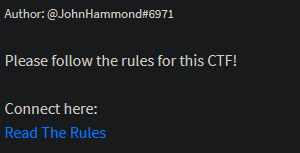
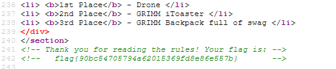
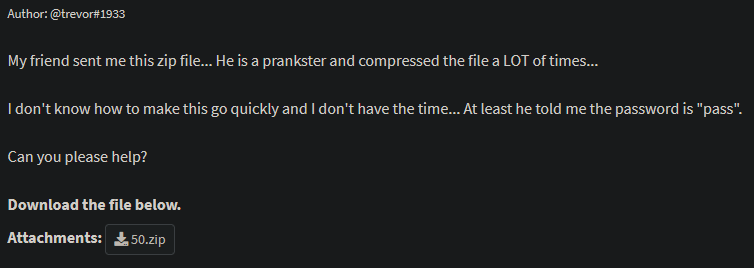
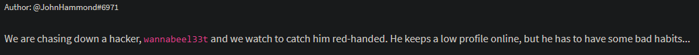
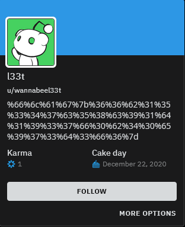
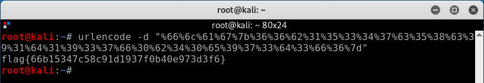

# GrimmCon CTF 2020

## WARMUP

### 1- Read the rules



After reading the CTF rules, we have no indication on what to do, the first thing to do is to check in the source code. The first flag is on line 142.



flag{90bc54705794a62015369fd8e86e557b}

### 2- Zip Zip



There is a .zip file to download that has been compressed 50 times. We are given the password "pass" and indeed when we decompress it, we end up with 49.zip then 48.zip etc. To avoid having to do it fifty times, I will use a simple but effective powershell script.

```powershell
$i = 0
Do{
$7ZipPath = '"C:\Program Files\7-Zip\7z.exe"' 
$zipFile = '"D:\Téléchargements\50.zip"' 
$zipFilePassword = "pass" 
$command = "& $7ZipPath e -oD:\chall -y -tzip -p$zipFilePassword $zipFile" 
iex $command

$7ZipPath = '"C:\Program Files\7-Zip\7z.exe"' 
$zipFile = '"D:\chall\*.zip"' 
$zipFilePassword = "pass" 
$command = "& $7ZipPath e -oD:\chall -y -tzip -p$zipFilePassword $zipFile" 
iex $command
}Until($i -eq 50)
```

## OSINT

### 1- wannabeel33t



By searching for wannabeel33t on Google, one quickly find a link to has reddit profile. In particular this string which looks like an [encoded URL](https://fr.wikipedia.org/wiki/Encodage-pourcent).



The -d parameter is used to specify that you want to decode the char string



flag{66b15347c58c91d1937f0b40e973d3f6}
